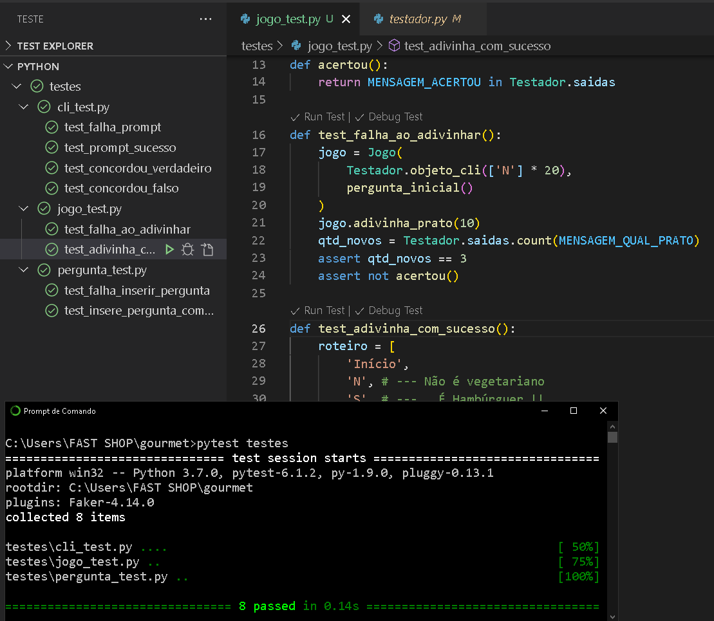

# Jogo Gourmet
#####  por: `Júlio Cascalles`

```
É uma adaptação para Python do jogo com mesmo nome, onde o objetivo é adivinhar qual prato você está pensando, através de perguntas.
```

---
### Como rodar
Esta versão é um CLI, ou seja, roda em linha de comando, assim:
> `python Gourmet.py`


---
### Testes unitários
As seguintes situações foram testadas:



* cli_test (interface de linha de comando com o usuário)
    * Falha no prompt: Simula que o usuário digitou uma resposta inválida;
    * Prompt com sucesso: Simula a digitação de um número em uma entrada que só aceita números.
    * Concordou verdadeiro: Simula a digitação de Sim ("S") na função `concordou`;
    * Concordou falso: Simula a digitação de Não ("N") na função `concordou`;
* jogo_test (regras do jogo):
    * Falha ao adivinhar: Ao responder sempre Não ("N"), nunca vai acertar o prato escolhido;
    * Adivinha com sucesso: Dado um roteiro de respostas, o jogo deve acertar o prato esperado.
* pergunta_test (Testa o modelo de dados do jogo):
    * Falha ao inserir: Não pode substituir a pergunta inicial
    * Insere pergunta com sucesso: Após inserida, um roteiro permite localizar a resposta correta na posição esperada.


---
### Observações
* O jogo foi desenvolvido em _Python 3_
* O jogo **não grava** os dados em lugar nenhum, portanto a cada execução começa do zero.
* Não existe verificação de duplicidade para o(s) prato(s) informado(s).
